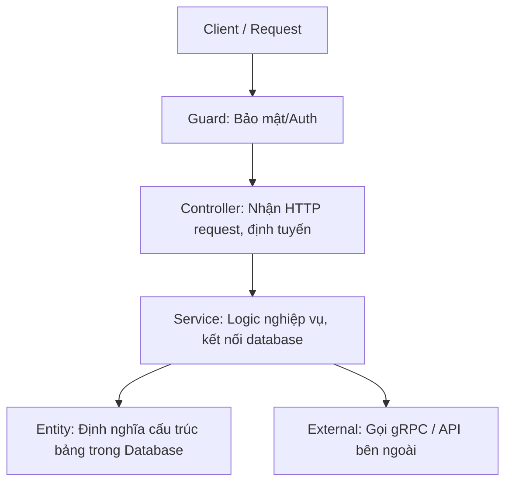

# 🎓 MediaServiceNest - NestJS Learning & Migration Project

Chào mừng bạn đến với dự án migrate `MediaService` từ ExpressJS sang NestJS bằng **pnpm**! Dự án này được thiết kế theo từng bước để giúp bạn vừa học các khái niệm cốt lõi của NestJS vừa áp dụng trực tiếp vào dự án thực tế.

---

## 🏗️ Kiến trúc cơ bản của NestJS

NestJS được xây dựng xoay quanh nguyên lý **Dependency Injection (DI)** và **Module-based architecture** tương tự Angular. Dưới đây là các khái niệm bạn sẽ học qua từng Phase:



### Các thành phần chính:
1.  **Module (`*.module.ts`)**: Nơi gom nhóm và quản lý các Controller, Service (Providers). Tất cả mọi thành phần muốn sử dụng đều phải được đăng ký trong Module.
2.  **Controller (`*.controller.ts`)**: Đóng vai trò định tuyến (routing), nhận request từ client, xử lý HTTP methods (`@Get`, `@Post`, `@Put`, `@Delete`) và trả về response.
3.  **Service / Provider (`*.service.ts`)**: Chứa logic xử lý nghiệp vụ chính (business logic). Các class được đánh dấu decorator `@Injectable()` để có thể được Inject vào Controller hoặc Service khác.
4.  **Entity (`*.entity.ts`)**: Class đại diện cho một bảng trong cơ sở dữ liệu khi sử dụng TypeORM.
5.  **DTO (Data Transfer Object)**: Class định nghĩa định dạng dữ liệu gửi từ client lên server, kết hợp với `class-validator` để validate dữ liệu tự động.
6.  **Guard (`*.guard.ts`)**: Dùng để xử lý xác thực (Authentication) và phân quyền (Authorization) trước khi request đi vào Controller.

---

## 🛠️ Hướng dẫn sử dụng NestJS CLI

Vì chúng ta sử dụng **pnpm**, thay vì chạy `nest <command>`, bạn hãy chạy thông qua `pnpm exec nest` hoặc `npx nest`:

*   **Tạo Module mới**:
    ```bash
    pnpm exec nest g module <module_name>
    ```
*   **Tạo Controller**: (Thêm `--no-spec` để không sinh file test `*.spec.ts`)
    ```bash
    pnpm exec nest g controller <controller_name> --no-spec
    ```
*   **Tạo Service**:
    ```bash
    pnpm exec nest g service <service_name> --no-spec
    ```
*   **Tạo trọn gói cả bộ CRUD (Module, Controller, Service, Entity, DTO)**:
    ```bash
    pnpm exec nest g resource <resource_name>
    ```

*Ví dụ:* Khi bạn chạy `pnpm exec nest g module media`, NestJS CLI sẽ:
1. Tạo thư mục `src/media`.
2. Tạo file `media.module.ts`.
3. Tự động import và đăng ký `MediaModule` vào `AppModule` ở file `src/app.module.ts`.

---

## 🚀 Các lệnh phát triển dự án

Đảm bảo bạn đã cài đặt đầy đủ các package thông qua pnpm:

```bash
# Cài đặt dependency
pnpm install

# Chạy server ở chế độ Development (Tự động tải lại khi sửa code)
pnpm run start:dev

# Chạy server ở chế độ Production
pnpm run start:prod
```

Server NestJS mặc định sẽ chạy ở cổng `http://localhost:3000` (sau này chúng ta sẽ cấu hình lại cổng thành `7154` ở file `.env` để trùng khớp với cổng cũ của ExpressJS).

---

## 📅 Lộ trình học tập & Di chuyển từng bước

*   **Phase 1**: Khởi tạo cấu trúc cơ bản và đọc hiểu (Đang thực hiện).
*   **Phase 2**: Cấu hình môi trường (`.env`) và kết nối PostgreSQL qua TypeORM. Bạn sẽ học cách tạo Entity và sử dụng Repository để tương tác DB thay vì viết query SQL dạng chuỗi.
*   **Phase 3**: Xây dựng gRPC Client và tích hợp Cloudinary (Học cách dùng Custom Providers và Dependency Injection nâng cao).
*   **Phase 4**: Viết Auth Guards, Custom Decorators phục vụ xác thực người dùng dựa trên JWT.
*   **Phase 5**: Di chuyển Module Media (Xử lý upload file thông qua Multer Interceptors).
*   **Phase 6**: Di chuyển các Module Templates & CourseTemplates (Tập trung vào CRUD và validate dữ liệu DTO).
*   **Phase 7**: Di chuyển Module Achievement (Vẽ Canvas, xuất file, tích hợp gRPC hoàn tất).
